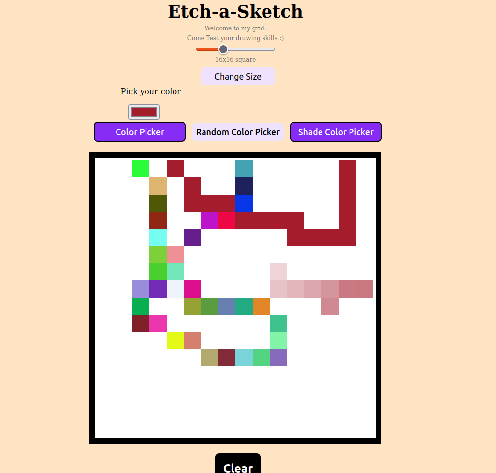
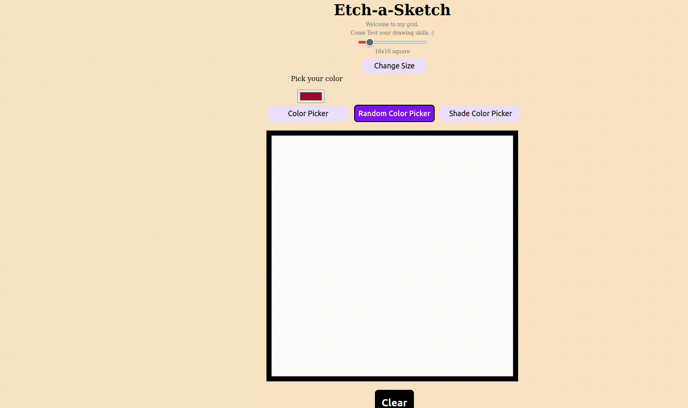

# Etch-a-Sketch

## Description
Little project to apply what I've learned of Html, CSS and base of javascript, in particular DOM manipulation.

## Working
We have a slider able to choose the number of pixels

We can also control the color used and even use a shader
